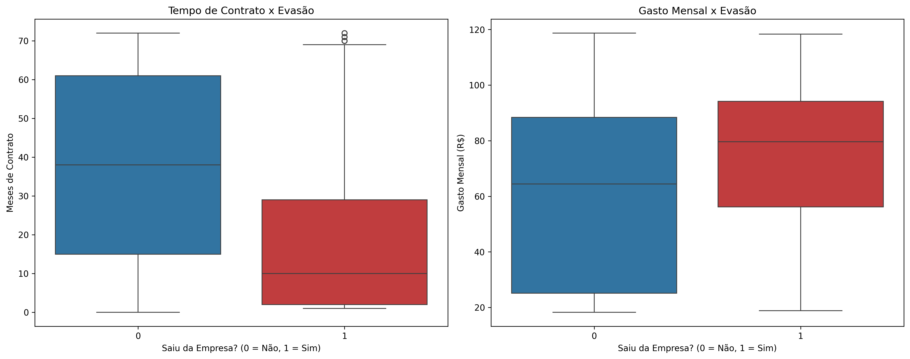
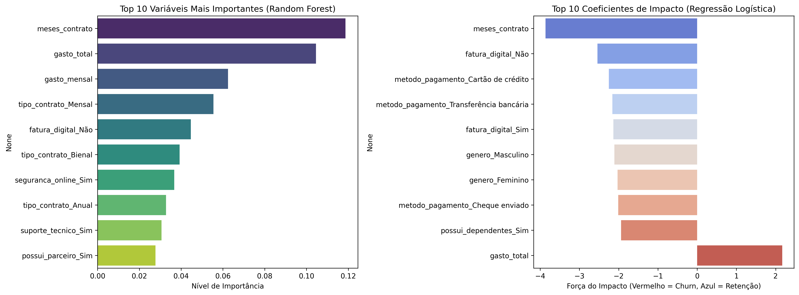

# Telecom X2 - Previsão de Churn com Machine Learning

    

## Visão geral do projeto
Este projeto é a segunda fase do desafio da **Telecom X**, focada na construção de um pipeline de Machine Learning para prever a evasão de clientes (Churn). O objetivo central foi preparar os dados, lidar com o desbalanceamento de classes, treinar modelos preditivos e extrair insights acionáveis para embasar estratégias de retenção.

## Stack tecnológica
- **Python & Pandas:** Carregamento de dados tratados e manipulação de DataFrames.
- **Scikit-Learn & Imbalanced-Learn:** Transformação categórica (One-Hot Encoding), normalização (MinMaxScaler), balanceamento de classes (SMOTE) e modelagem preditiva (Regressão Logística e Random Forest).
- **Matplotlib & Seaborn:** Geração de visualizações estatísticas (boxplots e barplots) para interpretação dos modelos e data storytelling.
- **Google Colab:** Ambiente de prototipagem e documentação técnica.

## Relatório Executivo e Resultados

### 1. Desempenho da Modelagem Preditiva
Desenvolvemos e testamos dois algoritmos de Machine Learning para antecipar a evasão de clientes:
* **Regressão Logística:** Apresentou o melhor desempenho na métrica principal (Recall de 57%), demonstrando maior capacidade de "pescar" clientes que realmente estão prestes a cancelar o serviço.
* **Random Forest:** Apresentou uma precisão superior (68%), sendo mais cauteloso antes de emitir um alerta de Churn, e obteve uma acurácia geral de 81%.

> **Recomendação Técnica:** Para problemas de retenção, o custo de perder um cliente (Falso Negativo) é muito maior do que o custo de oferecer um desconto para um cliente que ficaria (Falso Positivo). Portanto, o modelo de **Regressão Logística** foi escolhido como o ideal para a operação da Telecom X.

### 2. Análises Direcionadas
Antes da modelagem, confirmamos visualmente que clientes com contratos curtos e gastos elevados têm maior propensão à evasão.

  

### 3. Principais Fatores de Evasão (Insights dos Modelos)
A "abertura da caixa preta" dos modelos revelou padrões comportamentais claros:
1. **O Peso do Contrato:** O contrato mensal é o maior gatilho para o Churn.
2. **O Tempo é Crucial:** Os meses de contrato atuam como o maior escudo da empresa.
3. **O Custo Financeiro:** O gasto mensal elevado afasta fortemente os clientes.

  

## Recomendações Estratégicas
Com base nas predições do modelo selecionado e nos fatores de evasão identificados, sugerimos as seguintes ações para a equipe de negócios:

* **Automação de Descontos:** Conectar o modelo de Regressão Logística ao sistema de faturamento. Quando o algoritmo identificar um risco de Churn elevado para um determinado cliente, o sistema deve disparar automaticamente um e-mail com desconto atrativo para upgrade para o plano Anual.
* **Foco nos Primeiros Meses:** Aumentar o contato humano (equipe de Sucesso do Cliente) e oferecer serviços agregados gratuitos (como Segurança Online) durante os primeiros 6 meses de vida do cliente mensal, criando uma "barreira de saída" e aumentando o valor percebido do serviço.

## Como explorar a análise
1. Clone este repositório.
2. Abra o arquivo `Challenge3-dataScience-TelecomX2.ipynb` no [Google Colab](https://colab.research.google.com/).
3. Certifique-se de fazer o upload do dataset `dados_tratados.csv` (gerado na fase 1) no ambiente.
4. Execute as células sequencialmente para acompanhar a pipeline de pré-processamento, treinamento, avaliação e o relatório executivo final.

---
> *Transparência e Vibe Coding: A análise de dados, pipeline de Machine Learning e tomada de decisão estratégica apresentadas neste repositório são de minha autoria. A redação e formatação estrutural deste README, bem como o suporte técnico na otimização de métricas e relatórios, foram realizadas com auxílio de IA (Gemini), focando em agilidade e entrega profissional.*
